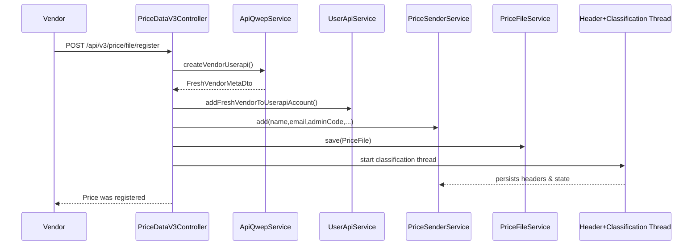
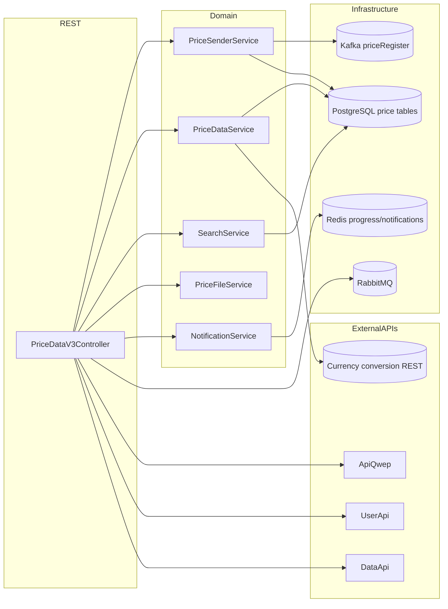

# QWEP Price Manager

## Overview
I started participating in this legacy project about a year ago. My primary contribution was fixing various bugs. After some time, the company decided to develop a new version of this service and assigned me responsibility for it. I successfully implemented the new version, which you can find [here.](https://github.com/DenisKonev/price-manager-v2) Price Manager is a Spring Boot service that onboards vendor price lists, classifies them, and exposes
search/ordering capabilities for downstream systems. The entry point wires AMQP, RabbitMQ queues, charset
detection, and validation infrastructure, highlighting that the application orchestrates messaging-heavy
workloads while running in the `Europe/Moscow` timezone.【F:src/main/java/org/qwep/qweppricemanager/QwepPriceManagerApplication.java†L1-L85】

The project focuses on the full lifecycle of a vendor price list:
1. Receiving and storing files together with metadata and contact info.
2. Driving interactive classification/configuration steps.
3. Persisting normalized rows into dedicated DB tables and exposing them via a search API.
4. Sending user notifications, mail, and queue events about the progress.

## Feature highlights
### Search with crosses
`PriceDataV3Controller` exposes `/api/v3/price/search`, which accepts a brand/article pair, resolves cross
references through the Data API, and queries consolidated price tables via `SearchService`. In-progress or
missing price tables are gracefully handled through `InProgressStateException`, `NoSuchVendorException`, and
other guards, ensuring the consumer always receives a response even while an upload is running.【F:src/main/java/org/qwep/qweppricemanager/rest/PriceDataV3Controller.java†L52-L130】【F:src/main/java/org/qwep/qweppricemanager/search/SearchService.java†L1-L121】

### Vendor onboarding and file registration
`/api/v3/price/file/register` coordinates several integrations: it authenticates the request with
`ApiQwepService`, creates vendor records via `UserApiService`, persists contact details with
`PriceSenderService`, streams the uploaded file into Mongo/SQL storage through `PriceFileService`, and then
launches `GetAndSavePriceHeadersClassificationAndFile` to capture headers and classification candidates before
passing the data to background processing threads.【F:src/main/java/org/qwep/qweppricemanager/rest/PriceDataV3Controller.java†L132-L208】

### Updates, classification, and configuration
Existing vendors update their catalogs through `/file/update`, which starts an `UploadThread` to parse rows and
hand them to `PriceDataService`. Admins can fetch and mutate classification blocks, trigger re-uploads, or
provide configuration objects (including currency conversion) that may schedule additional background jobs via
`CurrencyConversionRunnable`. State transitions are validated against `PriceState` flags to keep workflows safe
during concurrent uploads.【F:src/main/java/org/qwep/qweppricemanager/rest/PriceDataV3Controller.java†L210-L420】【F:src/main/java/org/qwep/qweppricemanager/rest/PriceDataV3Controller.java†L492-L632】【F:src/main/java/org/qwep/qweppricemanager/conversion/CurrencyConversionService.java†L1-L40】

### Dashboarding, notifications, and mail
The dashboard endpoint authenticates through QWEP, pulls vendor IDs, then enriches each entry with state,
security, and metadata gathered from `PriceSenderService` and `ApiQwepService`. Users can also fetch progress
indicators from Redis, subscribe to notification feeds stored in Redis via `NotificationService`, or request
basket operations that turn into templated emails delivered through `MainFunctionService` and the mail
subsystem.【F:src/main/java/org/qwep/qweppricemanager/rest/PriceDataV3Controller.java†L634-L754】【F:src/main/java/org/qwep/qweppricemanager/service/NotificationService.java†L1-L48】【F:src/main/java/org/qwep/qweppricemanager/service/MainFunctionService.java†L1-L40】

## Architecture & components
| Layer / Module | Responsibilities | Representative types |
| --- | --- | --- |
| REST layer | HTTP endpoints for search, uploads, dashboard, configuration, notifications, and basket
operations. Validates headers/cookies and orchestrates services. | `PriceDataV3Controller`, `SearchController` |
| Price sender domain | Persists vendor metadata, states, classification, and table references, emits Kafka
events for new prices, and exposes helpers for table cleanup or lifecycle validation. | `PriceSenderService`,
`PriceSenderInfoEntity`, `PriceSenderController`【F:src/main/java/org/qwep/qweppricemanager/pricesender/PriceSenderService.java†L1-L170】 |
| Price data domain | Creates dedicated SQL tables per price, writes validated `PriceDto` rows via
`PricedbRepository`, supports drop/change quantity operations, and guards against inconsistent quantities. |
`PriceDataService`, `Summary`, SQL functions under `src/main/resources`.【F:src/main/java/org/qwep/qweppricemanager/pricedata/PriceDataService.java†L1-L55】 |
| File staging | Stores raw uploads per vendor and spawns background threads that persist file bytes for
later processing. | `PriceFileService`, `FileSaverThread`, `GetAndSavePriceHeadersClassificationAndFile`.【F:src/main/java/org/qwep/qweppricemanager/pricefile/PriceFileService.java†L1-L32】 |
| Search & analytics | Executes stored procedures (`get_price_item`, `get_constrained_price_data*`) against
PostgreSQL, handles missing tables/states, and returns typed DTOs. | `SearchService`, SQL in `src/main/resources`.【F:src/main/java/org/qwep/qweppricemanager/search/SearchService.java†L1-L152】 |
| External integrations | Wraps API calls to QWEP core services, vendor management, user API, and the currency
conversion REST endpoint. | `ApiQwepService`, `UserApiService`, `DataApiService`, `CurrencyConversionService`.【F:src/main/java/org/qwep/qweppricemanager/conversion/CurrencyConversionService.java†L1-L40】 |
| Infrastructure | Uses RabbitMQ queues, Kafka, PostgreSQL, and Redis templates for caching/progress tracking;
encapsulates DB logic and lifecycle cleanup. | `QwepPriceManagerApplication`, `Core`, `NotificationService`.【F:src/main/java/org/qwep/qweppricemanager/QwepPriceManagerApplication.java†L58-L85】【F:src/main/java/org/qwep/qweppricemanager/data/Core.java†L1-L69】【F:src/main/java/org/qwep/qweppricemanager/service/NotificationService.java†L1-L48】 |

### Messaging, queues, and background jobs
* AMQP queues `q.price.loading.summary.orders`, `q.price.loading.orders`, `q.price.lifecycle.validation.orders`,
  `q.price.processing.awaiting`, and `q.viewCode.update.orders` are declared to interoperate with other
  services and workers through RabbitMQ.【F:src/main/java/org/qwep/qweppricemanager/QwepPriceManagerApplication.java†L71-L85】
* Kafka topic `priceRegister` receives serialized `PriceSenderInfoEntity` payloads whenever a new price sender
  is registered, enabling asynchronous downstream processing.【F:src/main/java/org/qwep/qweppricemanager/pricesender/PriceSenderService.java†L27-L85】
* `UploadThread`, `FileSaverThread`, and `CurrencyConversionRunnable` encapsulate heavy workloads (file IO,
  parsing, conversions) outside of the web threads, keeping API responses snappy even during large
  uploads.【F:src/main/java/org/qwep/qweppricemanager/rest/PriceDataV3Controller.java†L210-L308】【F:src/main/java/org/qwep/qweppricemanager/rest/PriceDataV3Controller.java†L540-L632】

### Persistence and SQL helpers
The repository expects PostgreSQL functions under `src/main/resources` (e.g., `get-price-data-sql-func.sql`,
`get-price-item.sql`, `sql/`) to exist in the target database. These functions return JSON that the services
map back into `PriceDto` lists. Dropping/counting tables is handled through `Core` and `PriceDataService`, which
execute parametrized SQL against the configured `DataSource`.【F:src/main/java/org/qwep/qweppricemanager/data/Core.java†L1-L69】【F:src/main/java/org/qwep/qweppricemanager/pricedata/PriceDataService.java†L1-L55】

## Running the service locally
1. **Prepare infrastructure.** Provision PostgreSQL with the stored procedures from `src/main/resources`, a
Redis instance for notifications/progress, RabbitMQ (matching the queues declared in the application class),
Kafka for `priceRegister`, and access to the QWEP external APIs used during onboarding.【F:src/main/java/org/qwep/qweppricemanager/QwepPriceManagerApplication.java†L58-L85】【F:src/main/java/org/qwep/qweppricemanager/service/NotificationService.java†L1-L48】【F:src/main/java/org/qwep/qweppricemanager/pricesender/PriceSenderService.java†L1-L85】
2. **Configure Spring.** Provide `application.yml`/`application.properties` with `spring.rabbitmq.*`, datasource
credentials, Redis beans (matching the `redis.internal` qualifier), Kafka brokers, and API endpoints. The source
already expects these keys via `@Value` and `@Qualifier` annotations.【F:src/main/java/org/qwep/qweppricemanager/QwepPriceManagerApplication.java†L32-L75】【F:src/main/java/org/qwep/qweppricemanager/service/NotificationService.java†L14-L33】
3. **Build & run.** Add the project to your existing Maven/Gradle Spring Boot build (a `pom.xml`/`build.gradle`
is not part of this repository snapshot) and launch `QwepPriceManagerApplication` through your preferred tool
(e.g., `mvn spring-boot:run` or your IDE).【F:src/main/java/org/qwep/qweppricemanager/QwepPriceManagerApplication.java†L24-L50】

## Mermaid diagrams
### Price file registration sequence

### Component and integration map

